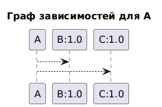
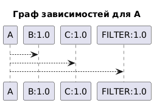
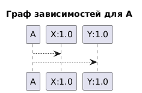

Александр Ирхин ИКБО-30-24 Вариант 9

Данный инструмент предназначен для анализа и визуализации графа зависимостей Maven-пакетов. Код написан на языке Pyhton. Для запуска тестирования созданы тестовые скрипты с расширением .cmd для каждого этапа.

Основные функции:

    Анализ зависимостей - загрузка и парсинг POM-файлов из Maven-репозиториев
    Построение графа - алгоритм DFS без рекурсии для построения полного графа зависимостей
    Фильтрация - исключение пакетов по заданной подстроке
    Обнаружение циклов - выявление циклических зависимостей
    Топологическая сортировка - определение порядка загрузки зависимостей
    Тестовый режим - работа с упрощенными текстовыми файлами зависимостей

Ход разработки согласно этапам:

Этап 1: Минимальный прототип с конфигурацией

- Реализован парсинг аргументов командной строки
- Добавлены все требуемые параметры:
  * --package - имя анализируемого пакета
  * --repo - URL репозитория или путь к файлу
  * --test-mode - режим тестового репозитория
  * --version - версия пакета
  * --max-depth - максимальная глубина анализа
  * --filter - подстрока для фильтрации пакетов
- Реализована валидация параметров с сообщениями об ошибках
- Добавлен вывод всех параметров в формате ключ-значение

Этап 2: Сбор данных о зависимостях
- Реализована функция get_direct_dependencies для получения POM-файлов из Maven-репозитория
- Добавлен парсинг XML для извлечения информации о зависимостях
- Реализован вывод прямых зависимостей пакета в консоль
- Обработаны ошибки загрузки и парсинга
- Обновлена валидация аргументов для проверки формата groupId:artifactId"

Этап 3: Основные операции над графом зависимостей

- Реализован алгоритм DFS без рекурсии для построения графа зависимостей
- Добавлена поддержка максимальной глубины анализа
- Реализована фильтрация пакетов по подстроке
- Добавлена обработка циклических зависимостей
- Реализован тестовый режим с чтением зависимостей из файла

"Этап 4: Дополнительные операции над графом зависимостей

- Реализован режим вывода порядка загрузки зависимостей (--show-order)
- Добавлена функция calculate_load_order для топологической сортировки графа
- Реализовано обнаружение циклических зависимостей при расчете порядка загрузки
- Объяснены возможные расхождения с реальным Maven"

Сравнение с реальным менеджером пакетов:
- Реальные менеджеры пакетов могут использовать другие алгоритмы разрешения зависимостей
- Наш алгоритм использует топологическую сортировку, которая может отличаться от реального Maven
- Расхождения могут быть вызваны:
  * Разными стратегиями разрешения конфликтов версий
  * Учетом scope зависимостей (compile, test, runtime)
  * Особенностями алгоритма Maven по разрешению транзитивных зависимостей

"Этап 5: Визуализация графа зависимостей

- Реализована функция generate_plantuml для генерации кода PlantUML
- Добавлен аргумент --visualize для включения визуализации
- Реализован вывод кода PlantUML в консоль

Сравнение с реальными инструментами визуализации:
- Реальные инструменты (например, Maven Dependency Plugin) могут:
  * Отображать разные типы зависимостей (compile, test, provided)
  * Показывать конфликты версий
  * Отображать scope зависимостей
- Наша визуализация показывает базовую структуру зависимостей
- Расхождения могут быть вызваны:
  * Отсутствием учета scope зависимостей в нашей реализации
  * Разными алгоритмами обхода графа
  * Особенностями разрешения конфликтов версий в Maven

Примеры визуализации зависимостей для трех различных пакетов, созданные с помощью сайта 
https://www.plantuml.com/plantuml/, представления этих графов на языке диаграмм PlantUML
создано в файле "test5.cmd"

 
-граф для теста 1

-граф для теста 2

-граф для теста 3